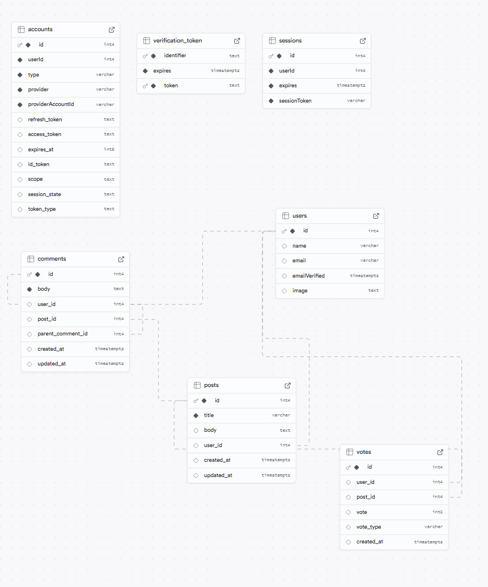

### What is the objective?

You've been asked to join an existing project team that is working on a prototype Reddit-style application. The project is in the early stages and the team is looking for someone to help flesh out the features and fix some of the issues with the prototype code base.

### Requirements

- 🎯 Deploy to Vercel - done

### Fixes & Feature Requests (Stretch goals)

- Fix page titles on post pages to match the post title - done
- Handle the error when you click to vote while not logged in to show a nice error message - done
- Try to make it so I can't vote more than once (Fix could be done in the SQL with the constraints (ideally), or in-app code to check the db before adding a new row to the votes table) - maybe
- Users can vote an infinite number of times on the same post. We'd like to prevent this happening. It should be enforced at the Schema level with the UNIQUE constraint but it isn't working. We'd like you to try and fix this, either by correcting the schema (preferable) or if not by implementing the restriction in the application code when the user tries to upvote. - maybe
- There are more potential stretch goals to choose from in the ReadMe - look at the future features if you are all done and twiddling your thumbs or you want to challenge yourself further.

### What went well

The goal for the assignment was to deploy a functional app to Vercel, which i managed to do fairly early thankfully. Shaun's video on gitHub Auth and README was very useful. I did have to amend one of the SQL create table queries to get it to work.

Implementing page titles on post pages was done by adding Metadata
I added a global error page to handle both posts that don't exist and also the issue of voting when not logged in.

### What I found difficult/interesting

Well firstly its an incredibly complex schema, it took me a while to get my head around it.

In addition, the actual app is fairly sophisticated, the Voting component took me a couple of hours to start to understand it - i think i do now, at least somewhat.

In the Vote.jsx component there is a function called handleVote(userId, postId, newVote). newVote is simply the value of the new vote (a +1 or -1 value).
In the function there is a long if statement. The first part of that checked if the existing vote value was the same as the new vote value and deleted the vote entry from the votes table if that was the case. This led to the vote number oscillating between +1 and 0 if you kept pressing upvote - not what is desired.
I commented out the delete statement as it seemed unnecessary (line 26 in my code). Now if you keep clicking upvote the vote count goes to +1 and stays there. I think this is whats needed.

My solution does seem too simple so i suspect i could be missing a leap of logic somewhere. Please enlighten me if that is the case.

### Sources I used

actually just moodle and past workshops
